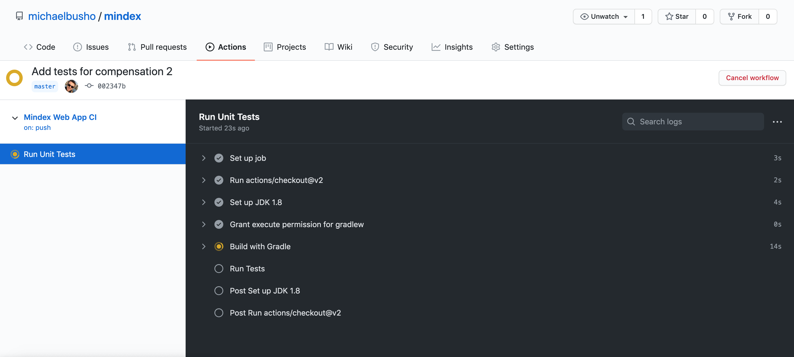

# Coding Challenge
## Deliverables 
This section showcases what exactly is implemented for this coding challenge. To get started:
1. Clone Repo
2. Run `gradlew bootRun`

### Task 1
In this task a new REST endpoint was implemented that receives an *employee id* and returns **the numbers of
reports under them** as well as the **hierarchical structure** (who reports to who)


| Api Specification| |
|:--------|----------|
|Method|GET|
|URL|http://localhost:8080/reporting/{id}|
|Response|JSON object|


##### -- Example --

With Postman or from your browser access the endpoint. 
For Employee with id : **16a596ae-edd3-4847-99fe-c4518e82c86f** make a GET request to this url
>http://localhost:8080/reporting/16a596ae-edd3-4847-99fe-c4518e82c86f

The server responds with: 
```json
{
    "numberOfReports": 4,
    "employee": {
        "employeeId": "16a596ae-edd3-4847-99fe-c4518e82c86f",
        "firstName": "John",
        "lastName": "Lennon",
        "position": "Development Manager",
        "department": "Engineering",
        "directReports": [
            {
                "employeeId": "b7839309-3348-463b-a7e3-5de1c168beb3",
                "firstName": "Paul",
                "lastName": "McCartney",
                "position": "Developer I",
                "department": "Engineering",
                "directReports": null
            },
            {
                "employeeId": "03aa1462-ffa9-4978-901b-7c001562cf6f",
                "firstName": "Ringo",
                "lastName": "Starr",
                "position": "Developer V",
                "department": "Engineering",
                "directReports": [
                    {
                        "employeeId": "62c1084e-6e34-4630-93fd-9153afb65309",
                        "firstName": "Pete",
                        "lastName": "Best",
                        "position": "Developer II",
                        "department": "Engineering",
                        "directReports": null
                    },
                    {
                        "employeeId": "c0c2293d-16bd-4603-8e08-638a9d18b22c",
                        "firstName": "George",
                        "lastName": "Harrison",
                        "position": "Developer III",
                        "department": "Engineering",
                        "directReports": null
                    }
                ]
            }
        ]
    }
}
```
There are 4 number of reports for the id we used (that of "John Lennon"). 2 directly under him and 2 under one of his direct employees. 
This json schema also showcases the structure of the employees (who reports directly to who) 

<sub><sup>**Check if the server runs on the same port number as this example</sup></sub>

### Task 2
For this task 2 new REST endpoints were implemented. One with which users are able to create
compensations (POST) and one with which users are able to get compensations (GET). Created compensations
are saved in the in-memory mongo database and can be retreived by a GET Request.

1.

     | Api Specification | |
     |:--------|----------|
     |Method|POST|
     |URL|http://localhost:8080/compensation|
     |Body|JSON object|
     |Response|JSON object|
     
     The request body needs to have a json object with this format
     ```json
        {
            "employee": {
                "employeeId": "16a596ae-edd3-4847-99fe-c4518e82c86f",
                "firstName": "Mihal",
                "lastName": "Busho",
                "position": "SE",
                "department": "App dev",
                "directReports": []
            },
            "salary": 1221.32,
            "effectiveDate": "2020-04-05"
        }
     ```
   Use a tool like Postman to verify the endpoint.
   
 2. Upon creating a compensation there is also an endpoint to retrieve it by its ID.
 
    | Api Specification | |
    |:--------|----------|
    |Method|GET|
    |URL|http://localhost:8080/compensation/{id}|
    |Response|JSON object|

    You can use the compensation id that it's returned after you create a compensation.
    
    <sub><sup>**Check if the server runs on the same port number as this example</sup></sub>

### Testing And CI 
Unit tests were developed to test each created endpoint. In addition, a new CI workflow has also been created (can be accessed by visiting actions in this repo)
which automatically runs the units tests and ensures there are no breaking changes everytime a new request is merged into master.



## Requirements - What's Provided 
A simple [Spring Boot](https://projects.spring.io/spring-boot/) web application has been created and bootstrapped 
with data. The application contains information about all employees at a company. On application start-up, an in-memory 
Mongo database is bootstrapped with a serialized snapshot of the database. While the application runs, the data may be
accessed and mutated in the database without impacting the snapshot.

### How to Run
The application may be executed by running `gradlew bootRun`.

### How to Use
The following endpoints are available to use:
```
* CREATE
    * HTTP Method: POST 
    * URL: localhost:8080/employee
    * PAYLOAD: Employee
    * RESPONSE: Employee
* READ
    * HTTP Method: GET 
    * URL: localhost:8080/employee/{id}
    * RESPONSE: Employee
* UPDATE
    * HTTP Method: PUT 
    * URL: localhost:8080/employee/{id}
    * PAYLOAD: Employee
    * RESPONSE: Employee
```
The Employee has a JSON schema of:
```json
{
  "type":"Employee",
  "properties": {
    "employeeId": {
      "type": "string"
    },
    "firstName": {
      "type": "string"
    },
    "lastName": {
          "type": "string"
    },
    "position": {
          "type": "string"
    },
    "department": {
          "type": "string"
    },
    "directReports": {
      "type": "array",
      "items" : "string"
    }
  }
}
```
For all endpoints that require an "id" in the URL, this is the "employeeId" field.

## What to Implement
Clone or download the repository, do not fork it.

### Task 1
Create a new type, ReportingStructure, that has two properties: employee and numberOfReports.

For the field "numberOfReports", this should equal the total number of reports under a given employee. The number of 
reports is determined to be the number of directReports for an employee and all of their distinct reports. For example, 
given the following employee structure:
```
                    John Lennon
                /               \
         Paul McCartney         Ringo Starr
                               /        \
                          Pete Best     George Harrison
```
The numberOfReports for employee John Lennon (employeeId: 16a596ae-edd3-4847-99fe-c4518e82c86f) would be equal to 4. 

This new type should have a new REST endpoint created for it. This new endpoint should accept an employeeId and return 
the fully filled out ReportingStructure for the specified employeeId. The values should be computed on the fly and will 
not be persisted.

### Task 2
Create a new type, Compensation. A Compensation has the following fields: employee, salary, and effectiveDate. Create 
two new Compensation REST endpoints. One to create and one to read by employeeId. These should persist and query the 
Compensation from the persistence layer.

## Delivery
Please upload your results to a publicly accessible Git repo. Free ones are provided by Github and Bitbucket.
